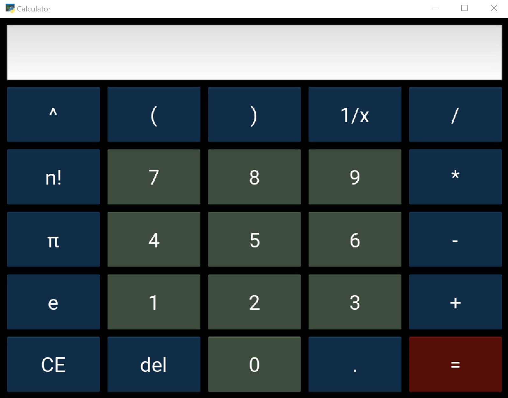

# Python Scripts
Collection of scripts I've written in Python

## `auto_open_tk.py`
Goal: leanring how to create a simple GUI in Python

Rundown:
* Click 'Open File' to add executables to the screen
* Click 'Run Apps' to run them all. 
* Click 'Delete All' to clear the list of Apps
When the app is closed, the file directories are saved to a .txt file and loaded back in the next time it is opened.

TODO: 'Remove' Individual Apps

## `calculator.py`
Calculator app created with Kivy

Goal: Creating more intricate GUIs in Python and even looking into creating apps that could outside of native Python environments. 
Ultimately it failed since creating an executable with PyInstaller meant including all dependancies (ofc), which took my 10 KB source code and created +200 MB behemoth.

Anyway, here's the interface:

## `pa_login.py`

Web driver that logs into my account in the BEST Private Area, the organizational tool for the student organization BEST

Goals: Learning the basics of web scraping and interacting with web pages, saving sensitive data (user name and password) in environmental variables instead of hardcoding them
On top of that, I created a batch file to run this script by clicking a shortcut

## `primes.py` and `test_primes.py`

Three simple implementations of prime number testers. The first one is very basic (and therefore extremely slow), the last one is alright

Goals: Learning how to code unit tests using the unittest library

